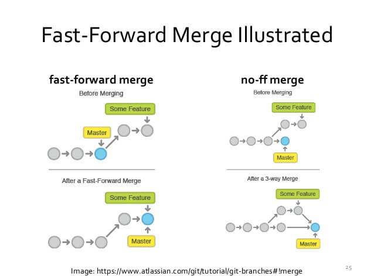

Thunggoen Lakchai 67111644

การทำ Merge ทำได้หลายแบบ เช่น การใช้ CLI หรือ เปิด Pull Requests
แต่เราจะทำแบบ CLI แบบ Fast Forward


การ Merge หลักๆ มี 3 แบบ
- Fast Foward
- Three Way merge
- Squash Merge

```bash
git checkout -b <name>
```
คำสั่ง checkout คือคำสั่งให้สลับ Branch

-b เพื่อให้สร้างและ สลับไปที่ Branch ใหม่ทันที

ถ้าเราแก้ไขทุกอย่างหมดแล้ว ให้เราสลับกลับไป brach ที่เราต้องการจะ Merge ด้วย Command
```
git checkout <name>
```

และใช้ Command merge เพื่อเริ่มทำการ Merge
```
git merge <name>
```
ถ้าหากมี Conflict ให้แก้ไข Conflict และ Commit ให้เรียบร้อย และทำการ Push ได้เลย
